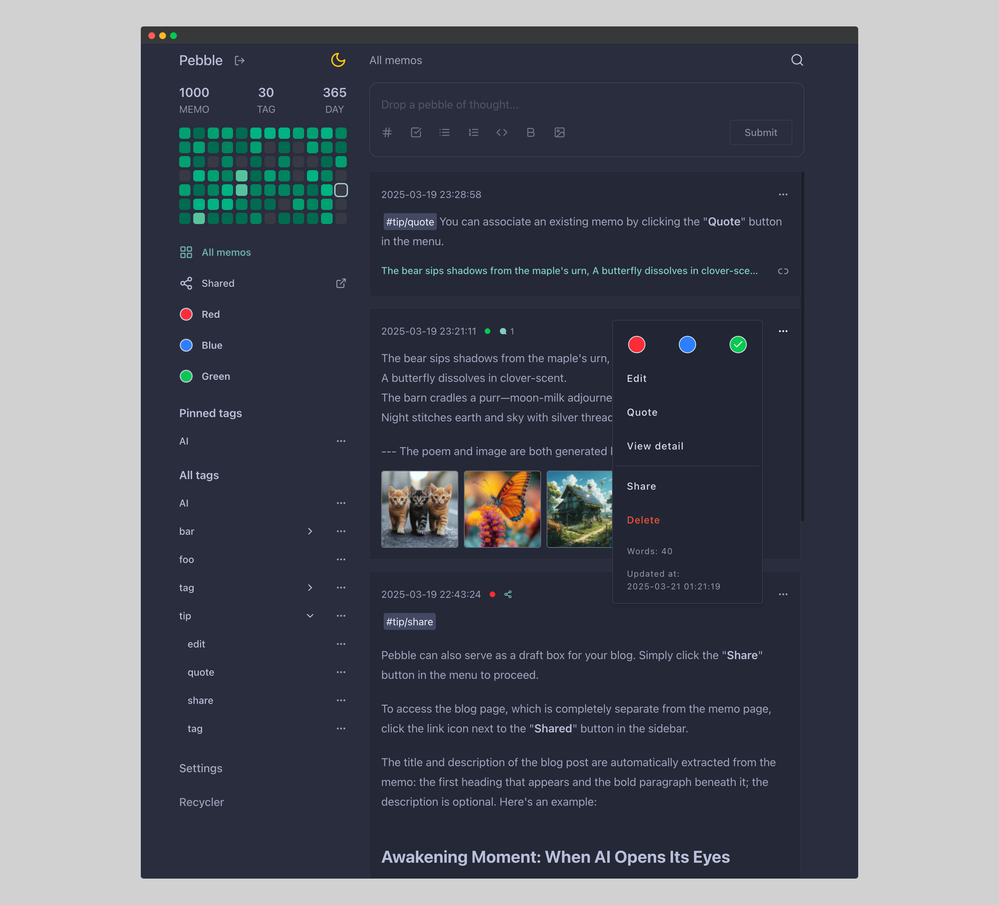

# Pebble

[中文介绍](./README-zh.md)

Pebble is a simple personal notebook and blog web APP.

## Features

* Share memos as blog
* Supports Markdown syntax, hashtags, and image galleries
* Automatically created tags, multi-level tags
* Full-text search
* Mobile-friendly
* Dark theme
* Minimal dependencies

## Development

### Frontend

The frontend is developed using React. Check the [pebble](./pebble) directory for details.

### Backend

There are four backend implementations in different languages, each providing the same functionality. You can choose any one for development.

Switch to the corresponding directory for details:

* [api-go](./api-go): Go + net/http

* [api-rs](./api-rs): Rust + Axum

* [api-kt](./api-kt): Kotlin + SpringBoot

* [api-py](./api-py): Python + Flask

## Deployment

This project provides a deployment example using Rust and Axum as the backend service, with production-level configurations such as HTTPS. Check the [deploy](./deploy) directory for details.

## About Choices

* Why SQLite?

  [SQLite is not a toy database](https://antonz.org/sqlite-is-not-a-toy-database/)

  For applications like this project, it is a near-perfect choice: zero configuration, extremely low memory and CPU usage, and decent performance.

* Full-text search without ElasticSearch

  I used the cheapest cloud server (about 10$/year) to deploy this project. ElasticSearch is too memory-intensive and simply cannot run on such a server.

  A simple inverted index + naive TF-IDF + Redis is sufficient for this project: [search_service.rs](./api-rs/src/service/search_service.rs).

* Why not Next.js?

  This project basically does not need SSR. The blog pages use good old Jinja, simple and without any black magic.

  Next.js adds an extra layer of mental burden to React: "Should this component be a Server Component?", "Should I use server actions?", "Why is the data cached?", "Which state management solution should I use?"...

  Of course, as the "de facto standard" among React frameworks, I often find myself quite pleased to work with Next.js.

* Four different backend APIs

  The initial backend service was written in Python. One day, a simple typo caused a hard-to-locate bug.

  After fixing that, I decided to rewrite it in Kotlin. Of course, it was mostly written by Claude 3.5 Sonnet, and the development experience was excellent.

  The only minor issue was the relatively high runtime memory usage, and my cloud server also hosts other services.

  Then I rewrote it in Rust, and the memory usage dropped to about 1/5 of the previous version.

  Finally, it was rewritten in Go, with 90% of the code written by Claude 4.5 Sonnet.

* Slate-based rich text editor

  The sunk cost is high, as I have already written approximately [3,000 lines](pebble/src/components/editor) of code based on [Slate](https://github.com/ianstormtaylor/slate).

  It is not perfect; beneath its simple and elegant API lies a rudimentary plugin mechanism, inexplicable bugs, subpar performance, and the fear of upgrading.

  If I were to refactor in the future, I might choose [Tiptap](https://github.com/ueberdosis/tiptap) and [Lexical](https://github.com/facebook/lexical).

## Acknowledgements

The UI draws inspiration from the card-based note-taking app [flomo](https://flomoapp.com/),
which offers a variety of clients and packs more features.

## License

MIT
